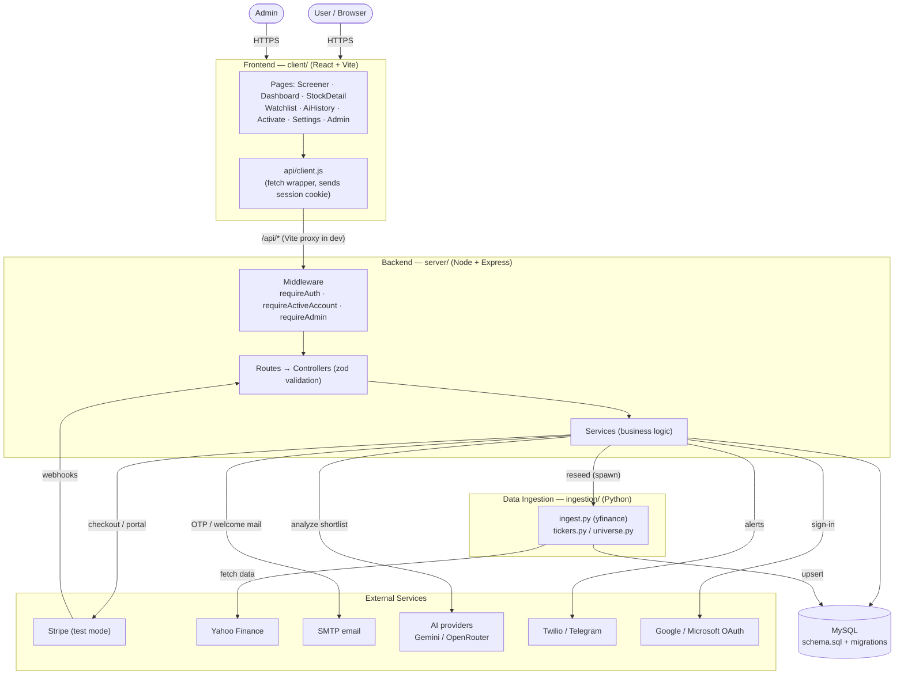

# System Architecture Diagram

System diagram for FullStack-Stockpicker. See
[architecture.md](architecture.md) for the narrative. Rendered copy:
`architecture-diagram.png`.

## Legend

- **Solid arrows** = calls / data flow in the direction shown.
- The **Vite dev server** proxies `/api/*` from the client to the Express API,
  so in development they share an origin (the session cookie flows
  transparently).
- The **Stripe webhook** is the one inbound external call — Stripe calls the API
  directly (`POST /api/subscription/webhook`), verified by signature, to keep
  `users.is_active` in sync on renewals/cancellations.
- **Ingestion** is normally run standalone, but an admin can trigger it via the
  API, which spawns `ingest.py` as a child process.
