# Entity-Relationship Diagram

Full ER diagram for the FullStack-Stockpicker MySQL schema (source of truth:
`server/src/db/schema.sql` + `server/src/db/migrations/`). Rendered copy:
`er-diagram.png`.

Notes:
- Composite primary keys (e.g. `stock` = `exchange_code` + `stock_code`) are
  marked `PK` on each participating column.
- `payment.user_id` is the deliberate exception to cascade delete: it is
  `ON DELETE SET NULL`, so deleting an account anonymizes its payments rather
  than erasing revenue history. Everything else user-owned cascades.
- `reseed_schedule` is a single-row config table (id fixed at 1) with no
  relationships.

```mermaid
erDiagram
    exchange ||--o{ stock : "lists"
    stock ||--o{ daily_price : "has prices"
    stock ||--o{ market_cap : "has market cap"
    stock ||--o{ dividend : "has dividends"
    stock ||--o{ financials : "has financials"
    stock ||--o{ watchlist : "watched in"
    stock ||--o{ stock_note : "noted in"
    stock ||--o{ starred_stock : "starred in"
    stock ||--o{ price_target : "targeted in"

    users |o--o{ payment : "makes (nullable)"
    users ||--o{ login_otp : "receives"
    users ||--o{ email_change_otp : "receives"
    users ||--o{ saved_criteria_set : "owns"
    users ||--o{ watchlist : "owns"
    users ||--o{ ai_analysis : "owns"
    users ||--|| ai_preferences : "has"
    users ||--o{ stock_note : "writes"
    users ||--o{ starred_stock : "stars"
    users ||--o{ price_target : "sets"

    saved_criteria_set ||--o{ saved_criteria_item : "contains"
    saved_criteria_set |o--o{ watchlist : "checked against"
    watchlist ||--o{ watchlist_alert_log : "logs alerts"

    exchange {
        varchar exchange_code PK
        varchar exchange_name
        varchar country
        varchar currency
    }
    stock {
        varchar exchange_code PK "FK -> exchange"
        varchar stock_code PK
        varchar stock_name
        varchar sector
        date listed_date
        tinyint is_active
    }
    daily_price {
        varchar exchange_code PK "FK -> stock"
        varchar stock_code PK "FK -> stock"
        date price_date PK
        decimal open
        decimal high
        decimal low
        decimal close
        bigint volume
    }
    market_cap {
        varchar exchange_code PK "FK -> stock"
        varchar stock_code PK "FK -> stock"
        date as_of_date PK
        decimal market_cap
    }
    dividend {
        varchar exchange_code PK "FK -> stock"
        varchar stock_code PK "FK -> stock"
        smallint year PK
        decimal dividend_cents
    }
    financials {
        varchar exchange_code PK "FK -> stock"
        varchar stock_code PK "FK -> stock"
        smallint year PK
        decimal revenue
        decimal profit_before_tax
        decimal profit_after_tax
        decimal ebita
    }
    users {
        char id PK
        varchar email UK
        varchar password_hash
        varchar name
        varchar google_id UK
        varchar microsoft_id UK
        longtext avatar
        tinyint is_active
        timestamp activated_at
        varchar stripe_customer_id
        varchar stripe_subscription_id
        varchar subscription_status
        timestamp current_period_end
        tinyint cancel_at_period_end
        tinyint is_admin
        timestamp created_at
    }
    payment {
        char id PK
        char user_id FK "-> users (SET NULL)"
        int amount_cents
        varchar currency
        enum status
        varchar payment_method
        varchar stripe_invoice_id UK
        timestamp paid_at
    }
    login_otp {
        char id PK
        char user_id FK "-> users"
        varchar code_hash
        timestamp expires_at
        timestamp consumed_at
    }
    email_change_otp {
        char id PK
        char user_id FK "-> users"
        varchar new_email
        varchar code_hash
        timestamp expires_at
        timestamp consumed_at
    }
    saved_criteria_set {
        char id PK
        char user_id FK "-> users"
        varchar name
        timestamp created_at
    }
    saved_criteria_item {
        char id PK
        char criteria_set_id FK "-> saved_criteria_set"
        varchar criteria_key
        decimal min_value
        decimal max_value
        decimal weight_value
    }
    watchlist {
        char id PK
        char user_id FK "-> users"
        varchar exchange_code FK "-> stock"
        varchar stock_code FK "-> stock"
        char saved_criteria_set_id FK "-> saved_criteria_set (SET NULL)"
        enum channel
        timestamp created_at
    }
    watchlist_alert_log {
        char id PK
        char watchlist_id FK "-> watchlist"
        timestamp triggered_at
        text message
    }
    ai_analysis {
        char id PK
        char user_id FK "-> users"
        varchar title
        json stocks
        mediumtext analysis_text
        timestamp created_at
    }
    ai_preferences {
        char user_id PK "FK -> users"
        varchar ai_model_tier
        varchar ai_persona
        varchar ai_detail_level
        varchar custom_instructions
    }
    stock_note {
        char id PK
        char user_id FK "-> users"
        varchar exchange_code FK "-> stock"
        varchar stock_code FK "-> stock"
        text body
    }
    starred_stock {
        char id PK
        char user_id FK "-> users"
        varchar exchange_code FK "-> stock"
        varchar stock_code FK "-> stock"
    }
    price_target {
        char id PK
        char user_id FK "-> users"
        varchar exchange_code FK "-> stock"
        varchar stock_code FK "-> stock"
        decimal target_price
    }
    reseed_schedule {
        tinyint id PK
        int interval_hours
        bigint next_run_at_ms
        bigint last_reseed_at_ms
        timestamp updated_at
    }
```

## Relationship summary

| Parent | Child | Cardinality | On delete |
|---|---|---|---|
| exchange | stock | 1 : many | CASCADE |
| stock | daily_price / market_cap / dividend / financials | 1 : many | CASCADE |
| stock | watchlist / stock_note / starred_stock / price_target | 1 : many | CASCADE |
| users | payment | 1 : many (nullable) | **SET NULL** |
| users | login_otp / email_change_otp | 1 : many | CASCADE |
| users | saved_criteria_set | 1 : many | CASCADE |
| users | watchlist / ai_analysis / stock_note / starred_stock / price_target | 1 : many | CASCADE |
| users | ai_preferences | 1 : 1 | CASCADE |
| saved_criteria_set | saved_criteria_item | 1 : many | CASCADE |
| saved_criteria_set | watchlist | 1 : many (nullable) | SET NULL |
| watchlist | watchlist_alert_log | 1 : many | CASCADE |
| _(none)_ | reseed_schedule | standalone single row | — |
